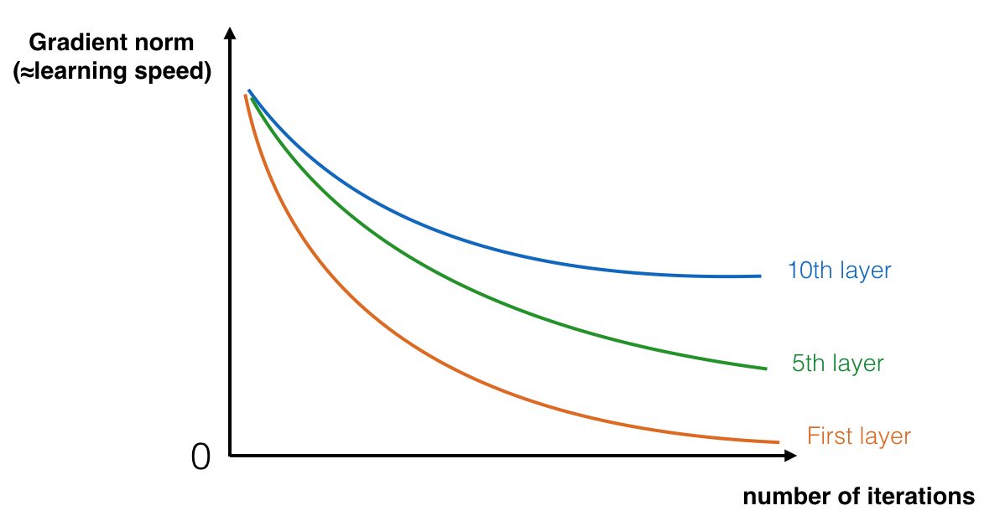
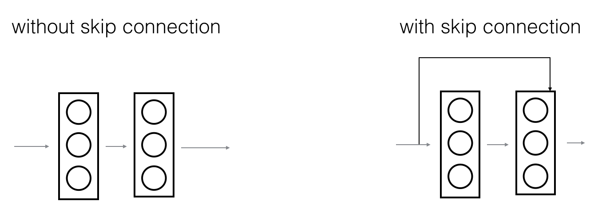
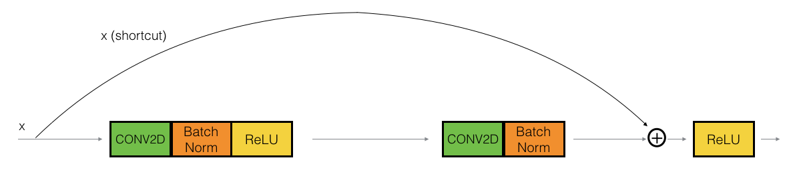
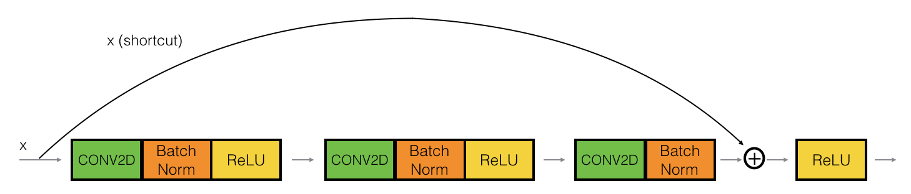
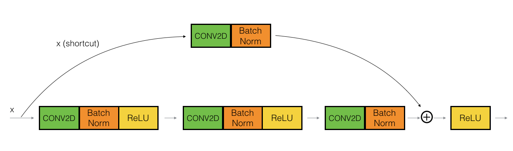
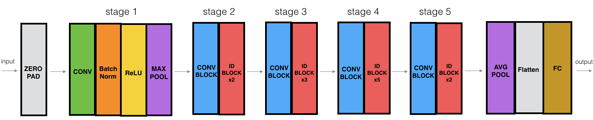
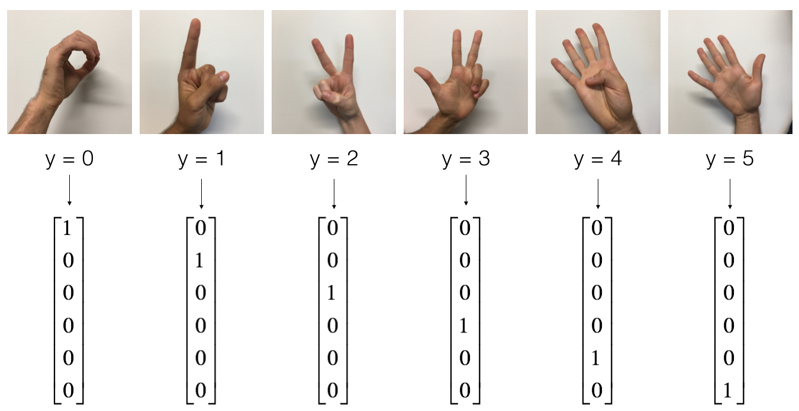

# 🧠 ResNet-50 Image Classification

A TensorFlow/Keras implementation of a **50-layer Residual Network (ResNet-50)** for multi-class hand-sign image classification using the **SIGNS dataset**.

This project focuses on understanding how residual learning and skip connections make very deep convolutional neural networks easier to train.

> This project was also part of my learning journey inspired and guided by the educational work of **Professor Andrew Ng**.

---

## 📌 Overview

As neural networks become deeper, they can learn increasingly complex representations. However, simply adding more layers can make optimization difficult, especially because of the **vanishing gradient problem**.

Residual Networks address this challenge with **shortcut (skip) connections**. Instead of requiring every layer to learn a completely new transformation, a residual block can pass information directly through a shortcut while the main path learns a residual mapping.

In this project, I implemented the main components of a ResNet-50:

- Identity residual blocks
- Convolutional residual blocks
- Shortcut connections
- Batch Normalization
- The complete 50-layer ResNet architecture
- Multi-class image classification with Softmax
- Model evaluation on the SIGNS test set
- Custom image inference

---

## 🎯 Project Goals

The main goals of this project were to:

- Understand why very deep neural networks can be difficult to train.
- Understand the vanishing gradient problem.
- Learn how residual/skip connections work.
- Implement an **identity block**.
- Implement a **convolutional block**.
- Assemble those blocks into a **ResNet-50** architecture.
- Train the network for image classification.
- Evaluate the trained model on unseen data.
- Experiment with predictions on personal images.

---

## 📚 Table of Contents

- [The Problem of Very Deep Neural Networks](#-the-problem-of-very-deep-neural-networks)
- [Residual Networks](#-residual-networks)
- [Identity Block](#-identity-block)
- [Convolutional Block](#-convolutional-block)
- [ResNet-50 Architecture](#-resnet-50-architecture)
- [SIGNS Dataset](#-signs-dataset)
- [Training](#-training)
- [Results](#-results)
- [Custom Image Prediction](#-custom-image-prediction)
- [What I Learned](#-what-i-learned)
- [Project Structure](#-project-structure)
- [Technologies](#-technologies)
- [Getting Started](#-getting-started)
- [References](#-references)
- [Contributing](#-contributing)
- [Author](#-author)
- [Acknowledgments](#-acknowledgments)
- [License](#-license)

---

# 🔍 The Problem of Very Deep Neural Networks

Very deep networks can represent complex functions and learn features at different levels of abstraction.

However, increasing depth does not automatically make a network easier to train.

One important challenge is the **vanishing gradient problem**. During backpropagation, gradients can become extremely small as they move toward earlier layers. When this happens, the shallower layers learn very slowly.

<p align="center">
  
</p>

This project addresses that problem by building a **Residual Network**.

---

# 🔗 Residual Networks

A ResNet introduces a **shortcut, or skip connection**, that allows information to bypass part of the main network path.

<p align="center">
  
</p>

Instead of learning only a transformation through the main path, the block combines the main path with the shortcut:

```text
Output = ReLU(Main Path + Shortcut)
```

By stacking residual blocks, we can construct very deep networks while making optimization more practical.

A key idea is that the network can learn an **identity mapping** when that is useful, allowing additional residual blocks to be stacked without requiring every block to learn a completely new representation.

---

# 🧱 Identity Block

The **identity block** is used when the input and output dimensions are compatible, so the shortcut can pass the original activation directly to the addition operation.

<p align="center">
  
</p>

The implementation used in this project contains three convolutional components:

```text
1×1 Conv → BatchNorm → ReLU
      ↓
f×f Conv → BatchNorm → ReLU
      ↓
1×1 Conv → BatchNorm
```

The original input is then added to the main path:

```text
Main Path + Shortcut → ReLU
```

The middle convolution uses an `f × f` kernel, while the first and third convolutions use `1 × 1` kernels.

The notebook also illustrates the three-layer identity block:

<p align="center">
  
</p>

### Identity Block Configuration

- First convolution: `1 × 1`
- First stride: `(1, 1)`
- First padding: `valid`
- Second convolution: `f × f`
- Second stride: `(1, 1)`
- Second padding: `same`
- Third convolution: `1 × 1`
- Third padding: `valid`
- Batch Normalization after each convolution
- ReLU after the first two convolutions
- No ReLU before the final addition
- Shortcut added to the main path
- Final ReLU after the addition

---

# 🔄 Convolutional Block

The **convolutional block** is used when the dimensions of the activation need to change.

Unlike the identity block, its shortcut path contains a convolution and Batch Normalization so that the shortcut can be added to the main path.

<p align="center">
  
</p>

The convolutional block also uses a stride that can reduce the spatial dimensions of the feature maps.

This makes the block useful at transitions between ResNet stages.

---

# 🏗️ ResNet-50 Architecture

The complete model is constructed by stacking convolutional and identity residual blocks in stages.

<p align="center">
  
</p>

The architecture implemented in the notebook follows this structure:

```text
Input (64 × 64 × 3)
        │
Zero Padding (3 × 3)
        │
7 × 7 Conv, 64 filters, stride 2
        │
BatchNorm → ReLU
        │
3 × 3 MaxPool, stride 2
        │
        ▼
Stage 2
Conv Block [64, 64, 256]
+ 2 Identity Blocks
        │
        ▼
Stage 3
Conv Block [128, 128, 512]
+ 3 Identity Blocks
        │
        ▼
Stage 4
Conv Block [256, 256, 1024]
+ 5 Identity Blocks
        │
        ▼
Stage 5
Conv Block [512, 512, 2048]
+ 2 Identity Blocks
        │
        ▼
Average Pooling
        │
Flatten
        │
Dense → 6 classes
        │
Softmax
```

### Architecture Summary

| Stage | Configuration |
|---|---|
| Input | `(64, 64, 3)` |
| Initial padding | `3 × 3` |
| Initial convolution | `64 filters, 7 × 7, stride 2` |
| Max Pooling | `3 × 3, stride 2` |
| Stage 2 | Conv Block `[64, 64, 256]` + 2 Identity Blocks |
| Stage 3 | Conv Block `[128, 128, 512]` + 3 Identity Blocks |
| Stage 4 | Conv Block `[256, 256, 1024]` + 5 Identity Blocks |
| Stage 5 | Conv Block `[512, 512, 2048]` + 2 Identity Blocks |
| Final pooling | Average Pooling |
| Classifier | Dense layer |
| Output | 6 classes with Softmax |

---

# 🖐️ SIGNS Dataset

The model is trained and evaluated using the **SIGNS dataset**, which contains hand-sign images belonging to six classes.

<p align="center">
  
</p>

The notebook reports:

- **1,080 training examples**
- **120 test examples**
- Image dimensions: **64 × 64 × 3**
- **6 classes**

### Preprocessing

Pixel values are normalized by dividing by `255`:

```python
X_train = X_train_orig / 255.
X_test = X_test_orig / 255.
```

The labels are converted to one-hot encoded matrices for multi-class classification:

```python
Y_train = convert_to_one_hot(Y_train_orig, 6).T
Y_test = convert_to_one_hot(Y_test_orig, 6).T
```

The resulting shapes are:

```text
X_train: (1080, 64, 64, 3)
Y_train: (1080, 6)

X_test:  (120, 64, 64, 3)
Y_test:  (120, 6)
```

---

# ⚙️ Training

The model was compiled using the Adam optimizer and categorical cross-entropy loss.

```python
opt = tf.keras.optimizers.Adam(learning_rate=0.00015)

model.compile(
    optimizer=opt,
    loss='categorical_crossentropy',
    metrics=['accuracy']
)
```

### Training Configuration

| Parameter | Value |
|---|---|
| Optimizer | Adam |
| Learning rate | `0.00015` |
| Loss | Categorical Cross-Entropy |
| Metric | Accuracy |
| Epochs | 10 |
| Batch size | 32 |

The model was trained for 10 epochs.

---

# 📈 Results

## Training Results

The recorded training run showed a strong improvement in accuracy over the 10 epochs:

| Epoch | Training Loss | Training Accuracy |
|---:|---:|---:|
| 1 | 1.8572 | 31.48% |
| 2 | 1.2479 | 52.69% |
| 3 | 0.8012 | 69.72% |
| 4 | 0.4625 | 84.35% |
| 5 | 0.3193 | 88.06% |
| 6 | 0.2178 | 92.31% |
| 7 | 0.2396 | 91.76% |
| 8 | 0.2039 | 93.15% |
| 9 | 0.2013 | 92.50% |
| 10 | **0.1647** | **94.17%** |

The training accuracy increased from **31.48% to 94.17%**, while the loss decreased substantially.

## Test Set Performance

After training for 10 epochs, the model achieved:

| Metric | Result |
|---|---:|
| Test Loss | **1.0717** |
| Test Accuracy | **75.83%** |

The difference between training and test performance is an important reminder that strong training accuracy does not necessarily translate directly to the same performance on unseen data.

---

# 🚀 Extended Pretrained Model

The notebook also provides a separately trained `resnet50.h5` model.

This model was trained for more iterations using GPU-based training and is evaluated separately from the 10-epoch training run above.

Its recorded test performance was:

| Metric | Result |
|---|---:|
| Test Loss | **0.1596** |
| Test Accuracy | **95.00%** |

> **Important:** The **75.83%** result is the test accuracy of the model trained for 10 epochs in the notebook. The **95.00%** result comes from the separately loaded pretrained `resnet50.h5` model. They should not be treated as the same training run.

---

# 🧪 Model Verification

The implementation was checked using the provided testing utilities.

The notebook reports successful verification for the residual blocks:

```text
All tests passed!
```

The complete ResNet-50 architecture was also compared against the provided reference model summary and passed the supplied verification.

This helped confirm that the implemented:

- `identity_block`
- `convolutional_block`
- `ResNet50`

followed the expected architecture.

---

# 📷 Custom Image Prediction

The notebook includes an optional workflow for testing the pretrained model on a personal image.

The image is:

1. Loaded from the `images/` directory.
2. Resized to `64 × 64`.
3. Converted into an array.
4. Expanded to include a batch dimension.
5. Normalized by dividing by `255`.
6. Passed through the pretrained ResNet-50.
7. Classified using the class with the highest predicted probability.

Example:

```python
img_path = 'images/my_image.jpg'

img = image.load_img(
    img_path,
    target_size=(64, 64)
)

x = image.img_to_array(img)
x = np.expand_dims(x, axis=0)
x = x / 255.0

prediction = pre_trained_model.predict(x)
print("Class:", np.argmax(prediction))
```

### Example Prediction

For the example image used in the notebook, the model produced:

```text
Class: 2
```

The prediction vector was:

```text
[p(0), p(1), p(2), p(3), p(4), p(5)]
```

with the highest probability assigned to **class 2**.

<p align="center">
  
</p>

---

# 🌍 Distribution Shift

The custom-image experiment highlights an important real-world machine learning concept: **distribution shift**.

A model can perform well on a benchmark test set but behave differently on personally captured images.

Factors that can affect predictions include:

- Lighting conditions
- Image composition
- Camera characteristics
- Background
- Image shape
- Preprocessing
- Differences between the training and real-world data distributions

This is an important lesson when moving from controlled datasets to real-world computer vision applications.

---

# 💡 What I Learned

This project helped me understand residual networks from the inside rather than simply using an existing ResNet implementation.

### Key lessons

- Why very deep plain networks can be difficult to train.
- How vanishing gradients affect deep neural networks.
- How skip connections provide an alternative path for information.
- How residual blocks can learn identity mappings.
- The difference between identity and convolutional blocks.
- How `1 × 1` convolutions can change channel dimensions.
- How strides can reduce spatial dimensions.
- How Batch Normalization is integrated into residual blocks.
- How the Keras Functional API represents branching architectures.
- How multiple residual blocks are assembled into ResNet-50.
- Why training accuracy and test accuracy can differ.
- Why distribution shift matters when deploying computer vision models outside their training environment.

---

# 📁 Project Structure

```text
resnet50-image-classification/
│
├── datasets/
├── images/
├── models/
│
├── .ipynb_checkpoints/
├── __pycache__/
│
├── Residual_Networks.ipynb
├── outputs.py
├── public_tests.py
├── resnets_utils.py
├── test_utils.py
├── resnet50.h5
├── .gitignore
└── LICENSE
```

### Important Notes

The repository `.gitignore` excludes generated files, model artifacts, and operating-system files:

```text
.ipynb_checkpoints/
__pycache__/
models/
resnet50.h5
Thumbs.db
```

This keeps large/generated files from being unnecessarily tracked by Git.

---

# 🛠️ Technologies

- **Python**
- **TensorFlow**
- **Keras**
- **NumPy**
- **SciPy**
- **Matplotlib**
- **Jupyter Notebook**

---

# 🚀 Getting Started

## 1. Clone the Repository

```bash
git clone <YOUR_GITHUB_REPOSITORY_URL>
cd resnet50-image-classification
```

## 2. Install Dependencies

The notebook uses TensorFlow, NumPy, SciPy, Matplotlib, and Jupyter.

```bash
pip install tensorflow numpy scipy matplotlib jupyter
```

## 3. Launch Jupyter Notebook

```bash
jupyter notebook
```

Then open:

```text
Residual_Networks.ipynb
```

## 4. Run the Notebook

Run the notebook from top to bottom to:

- explore the problem of very deep neural networks,
- understand residual connections,
- implement the identity block,
- implement the convolutional block,
- construct ResNet-50,
- load and preprocess the SIGNS dataset,
- train the model,
- evaluate its performance,
- and optionally test custom images.

---

# 📖 References

This project is based on the Residual Network architecture introduced by He et al.

### Paper

**Kaiming He, Xiangyu Zhang, Shaoqing Ren, Jian Sun.**

*Deep Residual Learning for Image Recognition* (2015).

The notebook also follows the implementation structure and takes significant inspiration from François Chollet's deep-learning-models repository.

### Learning Inspiration

This project was also part of my learning journey inspired and guided by the educational work of **Professor Andrew Ng**.

---

# 🤝 Contributing

This repository is primarily a learning project, but suggestions, improvements, and discussions are welcome.

If you find an issue or have an idea for improving the implementation or documentation, feel free to open an issue or submit a pull request.

---

# 👤 Author

**Qais Al-Tloa**

- 📧 [Email](mailto:qaisaltloa1@gmail.com)
- 🔗 [LinkedIn](https://www.linkedin.com/in/qais-al-tloa-911427330/)

---

# 🙏 Acknowledgments

A special thank you to **Professor Andrew Ng** and the **DeepLearning.AI** team.

Your educational resources continue to be an important part of my deep learning journey.

I also acknowledge the original authors of the ResNet architecture and the reference implementation that helped shape this project.

---

# 📄 License

A `LICENSE` file is included in the repository. Please refer to that file for the exact license terms.
